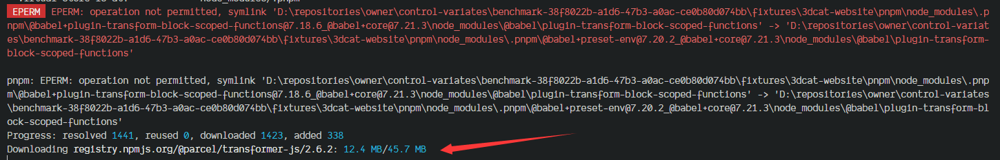

# Control Variates

Automated testing using the control variable method.

## Bootstrap

```shell
pnpm i
pnpm benchmark
```

```text
# Benchmark Results:
## .benchmark/xxx/benchmark.html
## .benchmark/xxx/benchmark.json
```

## Dependencies

- `tsx`: Executing code in node using ESM and TS.
- `chalk`: Beautifying console output.
- `rimraf`: For file deletion.
- `typescript`: Written with TS.
- `iconv-lite`: Solving the problem of messy Chinese output on the console.
- `cross-spawn`: Cross-platform compatible sub-process calls.

## Variables

系统参数：

- `CPU`
- `RAM`
- `DISK`
- `Node`
- `Project`

测试参数：

- `cache`
- `lockfile`
- `node_modules`

公平参数：

- `registry`
- `cacheDir`
- `storeDir`
- `ignoreScripts`
- `ignoreEngines`
- `ignorePeerDeps`

|  command  | cache | lockfile | node_modules |
| :-------: | :---: | :------: | :----------: |
| `install` |       |          |              |
| `install` |   ✔   |          |              |
| `install` |       |    ✔     |              |
| `install` |       |          |      ✔       |
| `install` |   ✔   |    ✔     |              |
| `install` |   ✔   |          |      ✔       |
| `install` |       |    ✔     |      ✔       |
| `install` |   ✔   |    ✔     |      ✔       |

## Todo

- [ ] 可视化操作
- [ ] 跨平台兼容
- [ ] 输出系统配置
- [ ] 文件删除
  - [ ] 异步删除
  - [ ] 增加 Loading
- [ ] 支持`monorepo`
- [ ] 支持变更依赖内容
- [ ] 支持多线程（限制系统参数）
  - [ ] 尝试使用 Rust 重写

## 重点审查

- [ ] 检查 Pnpm 有关缺失缓存的测试用例数据异常问题
- [ ] 根据跑分结果，分析并总结其内部结构与工作流程

## 遗留问题

若`package.json`中的依赖过多（标准项目，20 ~ 30 个依赖左右），当使用`Pnpm`进行安装时，若机器性能较弱，磁盘的占用率会长时间处于 100%。

**这有可能会导致操作系统卡死，只能强制按关机键重启，可能会丢失数据。**

经过我的观察（`Windows`），卡死的「点」基本上处于在对某些依赖的下载或链接上：

- `Babel PeerDependencies` 软链接失败
- `@parcel/transformer-js` 包体积过大（45MB）


