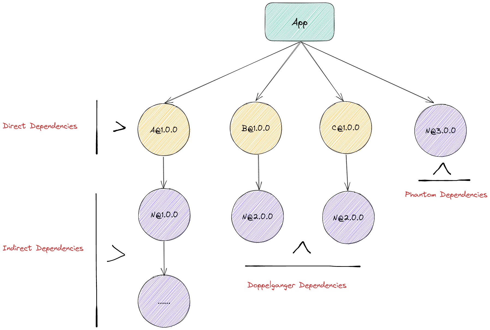
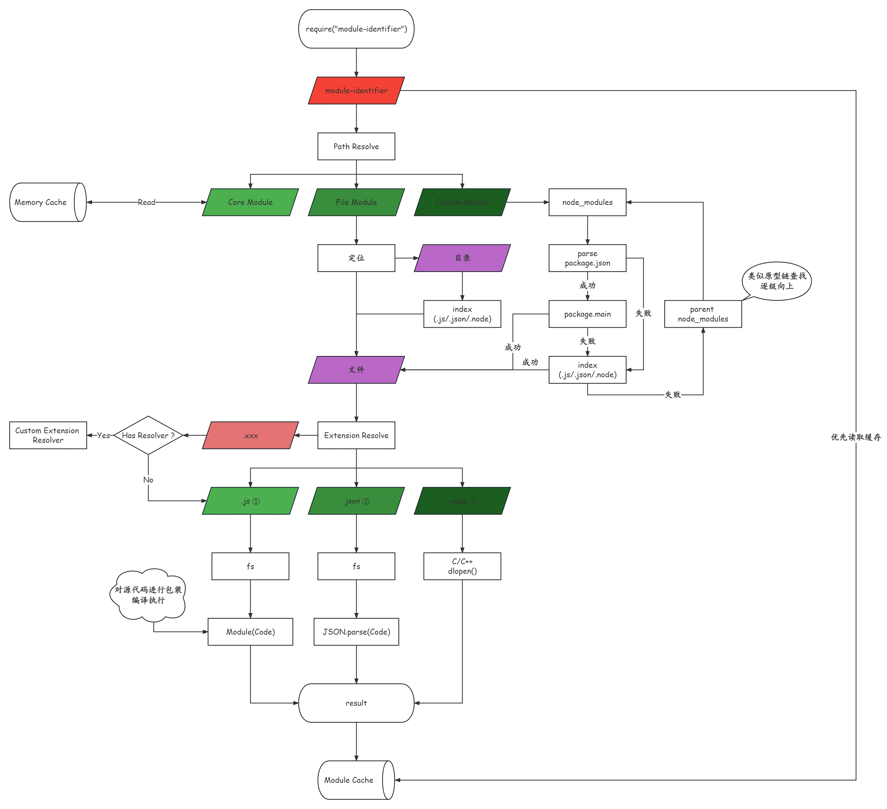

# History

> 本文及其后续由 GPT-3.5 协助创作。

本文着重阐述在 Node.js 中跟依赖管理相关的发展过程，主要涉及`NPM/Yarn/Pnpm`三大包管理器。

根据 NPM 的官方（[npm-cli](https://github.com/npm/cli#faq-on-branding)）介（pì）绍（yáo），`PM`的真正意义其实并不算是包管理器（Package Manager）的缩写，而是 pkg make inst，它是一个在不同平台上安装各种东西的 Bash 函数。

Me：

> 什么是 pkg make inst ？

GPT：

> pkg make inst 不是一个完整的指令，可能是三个指令的缩写。
>
> 其中，pkg 通常是指包管理器，在不同的操作系统中可能是不同的。比如在 FreeBSD 中，pkg 是用于安装、管理软件包的工具；在 Debian 系统中，apt-get 或者 apt 是常用的包管理器。
>
> make 是一个构建工具，通常用于编译、构建软件。可以用 Makefile 文件来指定构建动作、依赖关系等。
>
> inst 可能是指 install，即安装软件的指令。安装步骤可能包括复制文件、设置权限等。
>
> 因此，pkg make inst 可能是一个在 Unix/Linux 系统中安装软件的指令序列，具体内容可能需要结合上下文或者具体的操作系统等因素确定。

而 NPM 正是囊括了上述的几个功能，不过就理解意义上来说，PM 意指 Package Manager 也并无不妥之处，一语双关。

## 统一语言

在同一个上下文讨论中，依赖（Dependency）指的是一种关系，有时也会特指某些软件包或模块（依赖实体）。

Me：

> 在什么情况下，依赖指的是一种关系，还是特指某些软件包或模块？

GPT：

> 依赖关系通常在软件开发中指某些软件包或模块之间的依赖关系，即一个软件包或模块依赖于另一个软件包或模块。在这种情况下，依赖通常指特定的软件包或模块。
>
> 然而，在其他情况下，依赖也可以指两种实体之间的依赖关系，比如一个对象依赖于另一个对象。在这种情况下，依赖指的是一种关系，而不是特指某些软件包或模块。

因此，在前端这个领域中，我们在后文谈论依赖关系时，将采用「依赖/依赖关系」来表述，而在指代软件包时，则加上实体后缀，即采用「依赖包」来表述。

### 依赖结构与模块寻址

依赖关系图例：

[](https://excalidraw.com/#json=y0FHNqbpPG73rt2SyVNjP,wHKep1ADHc3wIqYbCxZTGg)

模块寻址算法：

根据 Node 的模块寻址算法，当一个依赖包处于`Top-Level node_modules`目录中（或更上层）时，这个依赖包可被项目所引用。



### 直接依赖 - Direct Dependencies

开发时所需的依赖。

在`package.json`中声明依赖，依赖包则被安装在`Top-Level node_modules`目录。

### 间接依赖 - Indirect Dependencies

直接依赖的依赖或更下层级的依赖，即泛指一切非直接依赖的依赖。

无需在`package.json`中声明，但会被安装在`node_modules`中，位于`Top-Level`还是其它层级，不确定，取决于包管理器的实现。

### 幻影依赖 - Phantom Dependencies

也叫幽灵依赖，是间接依赖中的特例，可被项目引用。

当一个间接依赖包被安装在与直接依赖包同级时，即位于`Top-Level node_modules`，这个依赖被称之为幻影依赖。

### 分身依赖 - Doppelganger Dependencies

涉及版本控制，当同一个版本的依赖包被安装多次时，意味着存在多个副本（分身）。

### 对等依赖 - Peer Dependencies

### 依赖关系图 - Dependency Graph

## NPM

> `NPM v1 ~ v2`

`npm`在设计之初，采用的是「**嵌套**」的方式建立`node_modules`目录结构：

```tree
node_modules
├─ A@1.0.0
│   └─ node_modules
│        └─ N@1.0.0
└─ B@1.0.0
    └─ node_modules
         └─ N@2.0.0
```

在「嵌套模式」下，很多同版本的依赖可能会被重复安装（**冗余**），或依赖链路过深（**地狱**），因为没有所谓的严格的版本管理：

```tree
node_modules
├─ A@1.0.0
│   └─ node_modules
│        └─ N@1.0.0     # 被安装第 1 次
├─ B@1.0.0
│   └─ node_modules
│        └─ N@2.0.0
└─ C@1.0.0
     └─ node_modules
          └─ N@1.0.0    # 被安装第 2 次
```

> `NPM v3`

于是，架构演变为「**扁平化**」的目录结构，即「**尽可能**」地提升「**次要依赖**」的作用域，将其与主要依赖平级放置，从而减少依赖冗余，缩减文件路径：

```tree
node_modules
├─ N@1.0.0              # 次要依赖 N 被提升
├─ A@1.0.0              # A@1.0.0 先被安装，所以 N@1.0.0 先被提升
├─ B@1.0.0
│   └─ node_modules
│        └─ N@2.0.0     # B@1.0.0 后被安装，所以 N@2.0.0 未被提升
└─ C@1.0.0
```

但也因此引入了以下几个问题：

- 不确定性 `Non-Determinism`
- 幽灵依赖 `Phantom dependencies`

不确定性：**由于依赖`N`存在多个版本，哪个版本会被提升取决于哪个版本是否是第一次出现然后被安装，后续出现的版本将被安装在依赖方的`node_modules`下（降级，采用`NPM v2`的方式进行安装，也解决不了冗余的问题），因此在复杂项目中，依赖的多变性可能会导致版本不兼容问题。**

即，依赖的关系取决于安装顺序，目录结构会因此不断的变化。

幽灵依赖：**是指在`package.json`中未定义的依赖，受限于依赖查找算法的规则，项目中可以正确地引用到该依赖，当未来这个依赖被丢弃（`A/B/C`不再依赖`N`），或版本发生变化后，可能会给项目本身带来麻烦。**

例如在示例中，我们只安装了`A/B/C`依赖，理论上也只会引用到这三个依赖，但由于依赖提升规则，`N`也可以被引用到。因为主要依赖和次要依赖被混合在一起。

## Yarn

因「幽灵依赖」而导致的相关问题只要稍加注意即可避免。

麻烦的是「不确定性」，因此`Yarn`首先提出「依赖图」的概念，即`yarn.lock`。

## monorepo

## 参考资料

- [How npm works docs](https://npm.github.io/how-npm-works-docs)
- [JavaScript 包管理器简史（npm/yarn/pnpm）](https://zhuanlan.zhihu.com/p/451025256)
- [深入浅出 npm & yarn & pnpm 包管理机制](https://zhuanlan.zhihu.com/p/526257537)
- [深入浅出 tnpm rapid 模式 - 如何比 pnpm 快 10 秒](https://zhuanlan.zhihu.com/p/455809528)
