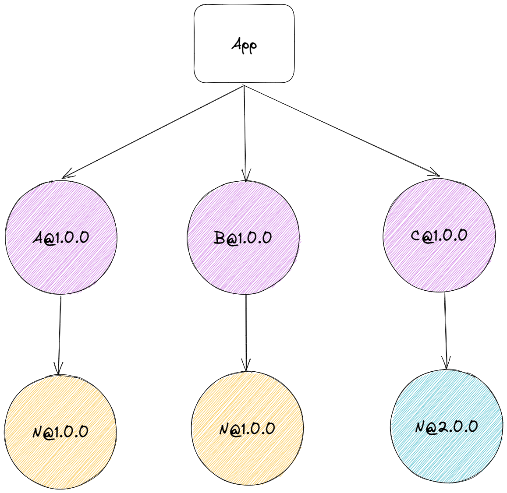
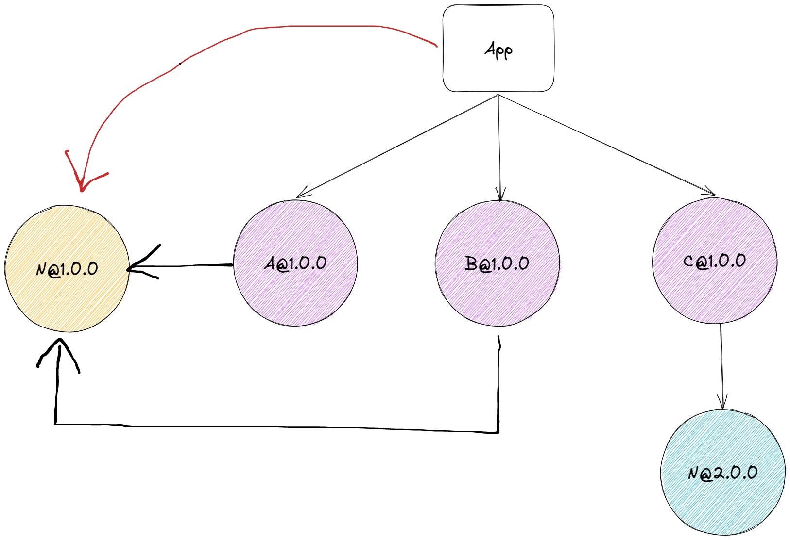
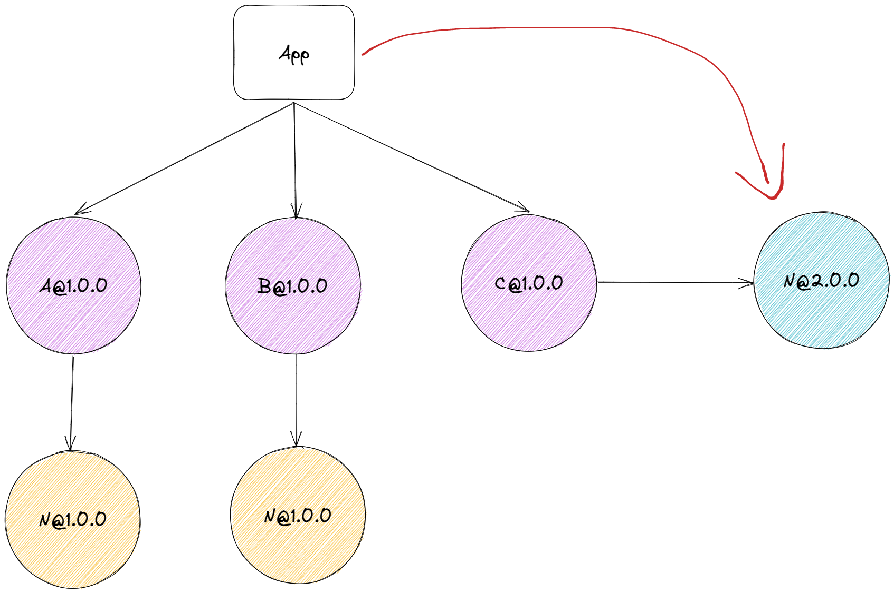

# History

> 本文及其后续由 GPT-3.5 协助创作。

本文着重阐述在 Node.js 中跟依赖管理相关的发展过程，主要涉及`NPM/Yarn/Pnpm`三大包管理器。

根据 NPM 的官方（[npm-cli](https://github.com/npm/cli#faq-on-branding)）介（pì）绍（yáo），`PM`的真正意义其实并不算是包管理器（Package Manager）的缩写，而是 pkg make inst，它是一个在不同平台上安装各种东西的 Bash 函数。

Me：

> 什么是 pkg make inst ？

GPT：

> pkg make inst 不是一个完整的指令，可能是三个指令的缩写。
>
> 其中，pkg 通常是指包管理器，在不同的操作系统中可能是不同的。比如在 FreeBSD 中，pkg 是用于安装、管理软件包的工具；在 Debian 系统中，apt-get 或者 apt 是常用的包管理器。
>
> make 是一个构建工具，通常用于编译、构建软件。可以用 Makefile 文件来指定构建动作、依赖关系等。
>
> inst 可能是指 install，即安装软件的指令。安装步骤可能包括复制文件、设置权限等。
>
> 因此，pkg make inst 可能是一个在 Unix/Linux 系统中安装软件的指令序列，具体内容可能需要结合上下文或者具体的操作系统等因素确定。

而 NPM 正是囊括了上述的几个功能，不过就理解意义上来说，PM 意指 Package Manager 也并无不妥之处，一语双关。

## 统一语言

在同一个上下文讨论中，依赖（Dependency）指的是一种关系，有时也会特指某些软件包或模块（依赖实体）。

Me：

> 在什么情况下，依赖指的是一种关系，还是特指某些软件包或模块？

GPT：

> 依赖关系通常在软件开发中指某些软件包或模块之间的依赖关系，即一个软件包或模块依赖于另一个软件包或模块。在这种情况下，依赖通常指特定的软件包或模块。
>
> 然而，在其他情况下，依赖也可以指两种实体之间的依赖关系，比如一个对象依赖于另一个对象。在这种情况下，依赖指的是一种关系，而不是特指某些软件包或模块。

因此，在前端这个领域中，我们在后文谈论依赖关系时，将采用「依赖/依赖关系」来表述，而在指代软件包时，则加上实体后缀，即采用「依赖包」来表述。

### 依赖结构与模块寻址

依赖关系图例：

模块寻址算法：

根据 Node 的模块寻址算法，当一个依赖包处于`Top-Level node_modules`目录中（或更上层）时（可通过输出`module.paths`查看模块目录），这个依赖包可被项目所引用。

### 直接依赖 - Direct Dependencies

开发时所需的依赖。

在`package.json`中声明依赖，依赖包则被安装在`Top-Level node_modules`目录。

### 间接依赖 - Indirect Dependencies

直接依赖的依赖或更下层级的依赖，即泛指一切非直接依赖的依赖。

无需在`package.json`中声明，但会被安装在`node_modules`中，位于`Top-Level`还是其它层级，不确定，取决于包管理器的实现。

### 幻影依赖 - Phantom Dependencies

也叫幽灵依赖，是间接依赖中的特例，可被项目引用。

当一个间接依赖包被安装在与直接依赖包同级时，即位于`Top-Level node_modules`，这个依赖被称之为幻影依赖。

### 分身依赖 - Doppelganger Dependencies

涉及版本控制，当同一个版本的依赖包被安装多次（冗余）时，意味着存在多个副本（分身）。

### 对等依赖 - Peer Dependencies

也叫同行依赖，为解决插件依赖的核心库版本和主项目依赖的核心库版本不一致的问题，避免多个依赖包共享同一个依赖包时所出现的不可预测的行为。

一般来说这些依赖包不会被安装，若主项目中没有或有，但版本不一致，则会发出警告或错误信息（包管理器可设置为自动安装）。

### 依赖关系图 - Dependency Graph

一个有向无环图，用于记录各个依赖包之间的依赖关系，确保每次安装都能得到一致的依赖结构。

## NPM

> `NPM v1 ~ v2`

`npm`在设计之初，采用的是「**嵌套**」的方式建立`node_modules`目录结构，在这种模式下，很多同版本的依赖可能会被重复安装（**冗余**），或依赖链路过深（**地狱**）。

如图所示，`N@1.0.0`被重复安装了 2 次，并且如若依赖链路过深，在 Windows 系统下可能会超出最长路径限制，从而影响文件 IO 的效率或直接失败。

> `NPM v3`

于是，架构演变为「**扁平化**」模式，即「**尽可能**」地提升「**间接依赖**」的作用域至与直接依赖平级，从而减少依赖冗余，缩减依赖链路。值得一提的是，此模式仅仅只是缓解问题而不能解决本质问题。

如图所示，当`A@1.0.0`「**先**」被安装时，`N@1.0.0`将被提升至`Top-Level node_modules`，而`B@1.0.0`也将共享此依赖包。

如果是`C@1.0.0`「**先**」被安装，则`N@2.0.0`会被提升，而`A`和`B`所依赖的`N@1.0.0`依旧走的是「嵌套模式」逻辑。

因此，缓解了一部分问题之后，随之而来的是引入了以下几个问题：

- 不确定性 `Non-Determinism`
- 幽灵依赖 `Phantom dependencies`

**不确定性：由于依赖`N`存在多个版本，哪个版本会被提升取决于哪个版本是否是第一次出现然后被安装，后续出现的版本将被安装在依赖方的`node_modules`下。即，依赖之间的关系取决于安装顺序，目录结构会因此不断的变化。**

不过即便如此，一般情况下各个依赖包之间也能够保证引用正确，这是因为有模块寻址算法的存在。

> 依赖复杂的项目可能会出现问题。

**幽灵依赖：受限于模块寻址算法，该依赖可以在项目中引用。**

例如在示例中，我们只安装了`A/B/C`依赖，理论上也只会引用到这三个依赖，但由于依赖提升规则，`N`也可以被引用到（依赖或 API 重名从而导致自动引入错误）。在未来如若这个依赖被废弃（`A/B/C`不再依赖`N`），或版本发生变化，可能会给项目本身埋下不兼容的隐患。

一般而言，这两个问题对于项目本身影响不大，只要稍加注意即可。

> 由于不确定性的存在，并发安装依赖是否会变得更为困难？

## Yarn

`Yarn`的出现主要是为了解决「不确定性」问题，即提出依赖关系图的概念：`yarn.lock`。

每次安装依赖时，首先会去`node_modules`找该依赖存不存在，然后才决定是否需要进行提升。

所以有时候拉取一个新项目下来，安装依赖后，`yarn.lock`的内容会发生变更，这是因为从零开始安装的`node_modules`的结构发生了变化。

这也是遇事不决，`rm -rf node_modules && yarn`的原因。

当然，`Yarn`还提供了许多加快依赖安装的特性，如缓存、多线程下载等。

## Pnpm

利用操作系统的软硬链接功能（部分平台需要额外兼容），及对依赖包进行的全局化存储：

1. 全局化存储则确保每个依赖版本只会安装一次，并纳入缓存（`.pnpm-cache`）。
2. 采用类似闭包的结构，嵌套一层虚拟存储文件夹，用于将依赖从全局存储（`.pnpm-store`）硬链接到项目的虚拟存储（`virtual store -> .pnpm`）中，再软链接到项目的`node_modules`，确保`Top-Level node_modules`中只存在直接依赖，防止幽灵依赖的产生。

`Pnpm`在结合了`NPM`和`Yarn`的经验，以及社区的思考实践后，解决了依赖冗余（分身依赖）以及幽灵依赖两大问题。

## 参考资料

- [How npm works docs](https://npm.github.io/how-npm-works-docs)
- [都 2022 年了，pnpm 快到碗里来！](https://juejin.cn/post/7053340250210795557)
- [JavaScript 包管理器简史（npm/yarn/pnpm）](https://zhuanlan.zhihu.com/p/451025256)
- [深入浅出 npm & yarn & pnpm 包管理机制](https://zhuanlan.zhihu.com/p/526257537)
- [深入浅出 tnpm rapid 模式 - 如何比 pnpm 快 10 秒](https://zhuanlan.zhihu.com/p/455809528)
