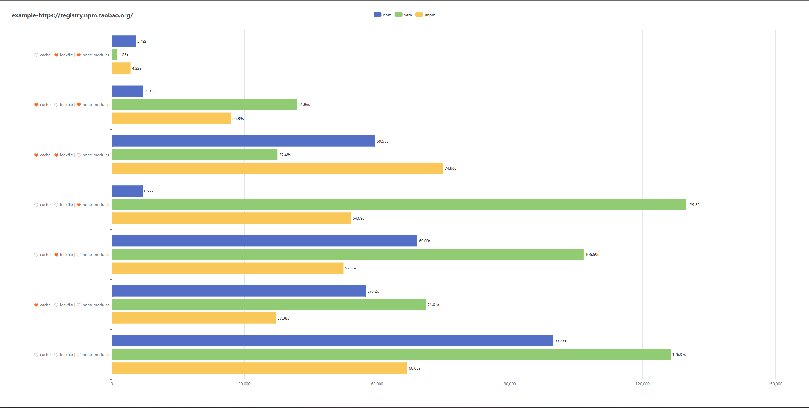
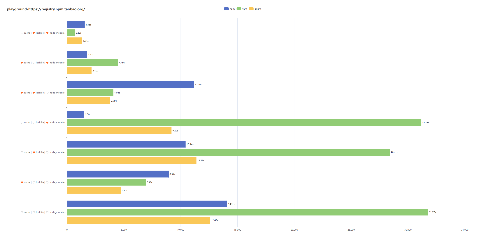

# Comparison

由于软链接在 Windows 下存在兼容性问题，`Pnpm`是借助了[第三方库（junctions）](https://www.pnpm.cn/faq#does-it-work-on-windows)来实现，因此在 Windows 下可能会存在性能损耗。

这可能也是我使用公司的 Windows 10 系统进行测试，当依赖链路过深时，进行软链接操作始终失败的原因。

## 关于各个包管理的侧重点

1. NPM 侧重于 node_modules：只要 node_modules 完整，符合 package.json 的声明，在测试用例里，安装速度基本上在 10s 以内。
2. Yarn 以 lockfile 为主，以 cache 为辅：由于 Yarn 可以看做是对 NPM 的增强版，因此为了确保依赖结构的一致性，将优先考虑对 lockfile 文件的处理。而 cache 则相当于离线压缩加密版的 node_modules，只要存在 cache，结合 lockfile 就能快速的「重塑」node_modules。
3. Pnpm 更侧重于 cache/store：因为它要确保依赖的版本唯一性，以及内容完整性。因此如若命中 cache，其安装速度的瓶颈受限于软硬链接的速度。

由于它们的内部构造以及工作流程尚未摸透，更多细节尚无从考究。

## Windows 11

## Windows 10 - WSL
