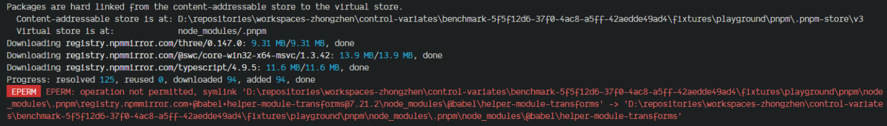
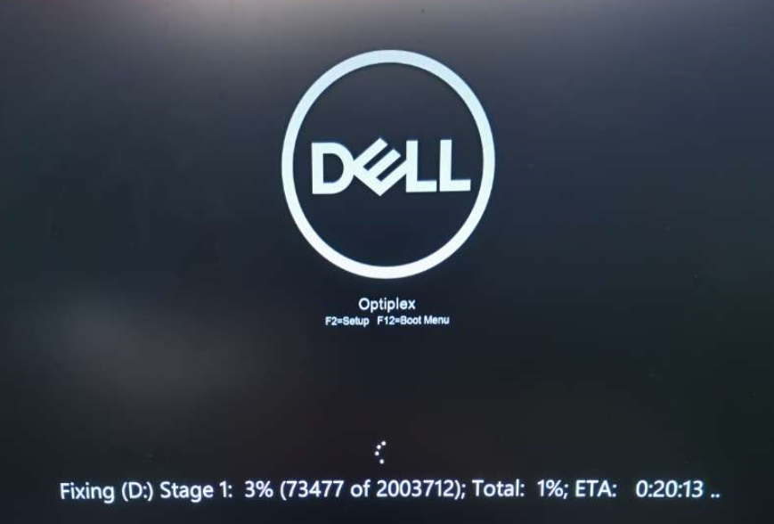
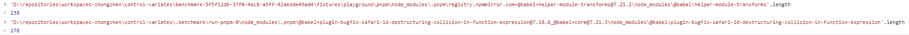

# FAQ

## 为何有时 Pnpm 软链接会失败？

经过一段时间的摸索与来回测试（公司电脑与家用电脑），发现只有公司的电脑会出现这个错误，而一旦出现这个错误，则会导致磁盘（HDD）占用率达到 100%，从而导致操作系统卡死，无奈只能强制开关机重启解决。

现结合资料检索与 GPT 的协助，将出现这个问题的原因缩小到如下范围：

- 磁盘损坏：磁盘老旧，有坏点，可能会导致软链接失败。
- 路径过长：超出 Windows 系统默认设置的最大路径（`MAX_PATH`）限制的 260 个字符。
- 权限拦截：根据错误信息（`operation not permitted`）的提示，表明这可能是受到操作系统的权限限制。

针对每个原因进行了估量测试与解释：

1. 针对磁盘损坏，在某次重启过程中发现需要进行磁盘自检修复（耗时将近 50 分钟），修复完成后可能会导致部分数据丢失，而在软链接的过程中会涉及大量的 IO 操作。

   

2. 针对路径过长，在摘取了部分失败结果的路径进行长度验证后，发现并不是每次的失败都会超出 260 个字符限制，并且根据官方提供的[教程](https://learn.microsoft.com/zh-cn/windows/win32/fileio/maximum-file-path-limitation?tabs=registry#enable-long-paths-in-windows-10-version-1607-and-later)，解除了最大路径字符数的限制后问题依旧存在，不知道是不是我的姿势对不对。

   

3. 针对权限拦截，由于错误信息非常明显的提示跟权限相关，于是我对操作系统的所有用户的权限进行了提升（设置为完全控制），问题依旧。不过在一篇[讨论](https://github.com/lovell/sharp/issues/1969)中发现有人提到，可能是杀毒软件拦截了操作（刚好公司的电脑安装有 360，不过退出需要管理员密码），但我把磁盘加入了信任区之后依旧无果。

综上，出现这个问题可能并非只是由某一个原因而导致的，可能混合了多方面的因素，并且出现的概率相对较低（单位以机器为粒度）。但由于涉及了更多层面的知识（操作系统？软硬件？），暂时超出了我的能力范畴。

## 为何使用 GPT 协助创作？

GPT 作为一个根据上下文来回答的助手，它能做的仅仅是「回答」你的问题，因此「问题」的本身需要人为的思考并提出，再提供给 GPT 作为 Prompt Token 去检索资料并给予回复。

人为思考问题并解决，最终固然能得出一个比较令人信服的结论，但这一个过程中可能需要去搜寻大量的资料，并从中摘取有用的关键词，总结成能令他人易于理解的表述，这个过程可能是比较耗时且费心费力的。

因此，使用 AI 协助我们对资料的检索与提取，并结合自身对问题的理解或纠正解决问题的方向，使其事半功倍。

当然，GPT 并不是万能的，它有时会「杜撰」不存在的内容，给出错误的答案，因此需要人为的再去验证答案的正确性或可行性。
